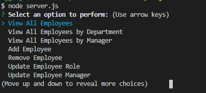
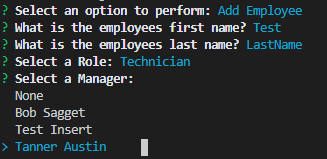
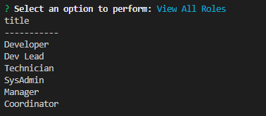

# Employee Tracker
## Description
A MySQL based CLI application using Node/Inquirer/MySQL plugins for javascript
## Table of Contents
* [Description](#Description)
* [Installation](#Installation)
* [Usage](#Usage)
* [License](#License)
* [Testing](#Testing)
* [Example Images](#Examples)
* [Questions](#Questions)

## Installation
Run a `npm install` after cloning down or downloading the repository
## Usage
After running the `npm install`, type in the command `node server.js`,You will then be prompted with a menu option selection of 14 choices
1) View all Employees - Display all employees in the database
2) View All Emp.. by Department - Displays all employees in a given department
3) View All Emp... by Manager - Displays all employees under a given manager
4) Add Employee - Allows you to add a new employee to the database
5) Remove Employee - Allows you to remove an employee from the database
6) Update Employee Role - Allows you to move an an employee to a new role
7) Update Employee Manager - Allows you to move an employee to be under a new manager
8) View All Roles - Displays all Roles in the database
9) Add Role - Allows you to enter a new role to the database
10) Remove Role - Allows you to delete a role from the database
11) View All Departments - Displays all departments in the database
12) Add Department - Allows you to add a department to the database
13) Remove Department - Allows you to delete a department from the database
14) Exit - Exits the application
### License
MIT
### Testing
No testing needed, simply run the program as directed in the Usage above
#### Example Images
 
 

#### Questions?
If you have questions regarding this program: 
Send me a message through GitHub:  
Or through email here: 
